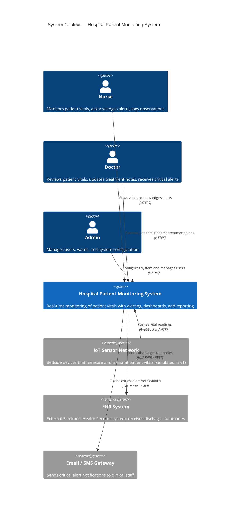
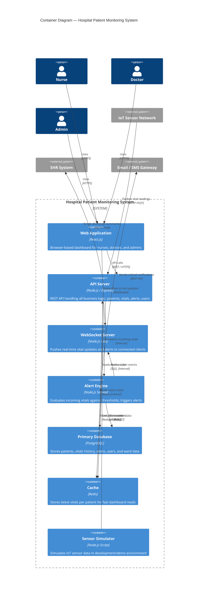
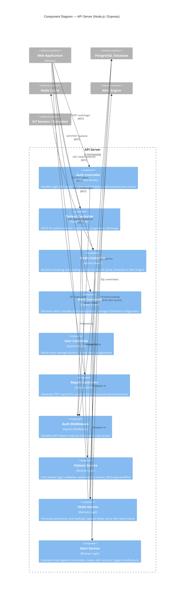
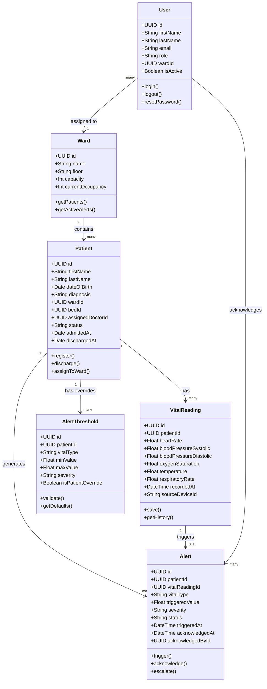
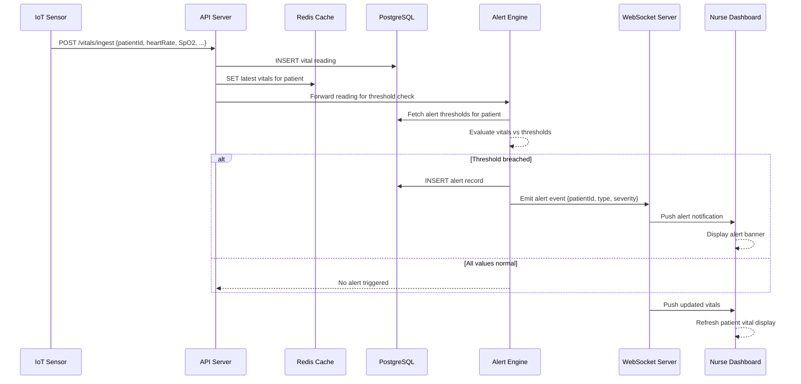

# ARCHITECTURE.md — Hospital Patient Monitoring System

---

## Project Title
**Hospital Patient Monitoring System (HPMS)**

## Domain
**Healthcare / Hospital** — Real-time patient vital signs monitoring and alert management across a hospital ward.

## Problem Statement
Hospitals need a centralized system that ingests patient vitals from bedside sensors, triggers alerts on threshold breaches, and gives clinical staff instant access to patient data through a unified dashboard.

## Individual Scope
Scoped to a single ward, three user roles (Doctor, Nurse, Admin), simulated IoT sensor data, and a web-based interface. Full feasibility justification in [SPECIFICATION.md](./SPECIFICATION.md).

---

## C4 Diagrams

The C4 model describes the architecture at four levels of zoom:
1. **Level 1 — System Context**: Who uses the system and what external systems does it touch?
2. **Level 2 — Container**: What are the major deployable parts of the system?
3. **Level 3 — Component**: What are the key components inside each container?
4. **Level 4 — Code**: Class/entity level detail for a key component

---

## Level 1 — System Context Diagram

> Shows HPMS in relation to its users and external systems.

---

## Level 2 — Container Diagram

> Shows the major deployable components (containers) of HPMS.

---

## Level 3 — Component Diagram (API Server)

> Zooms into the API Server container to show its internal components.

---

## Level 4 — Code Diagram (Vitals Service — Key Entities)

> Shows the data model and key classes for the Vitals Service component.

---

## End-to-End Data Flow

