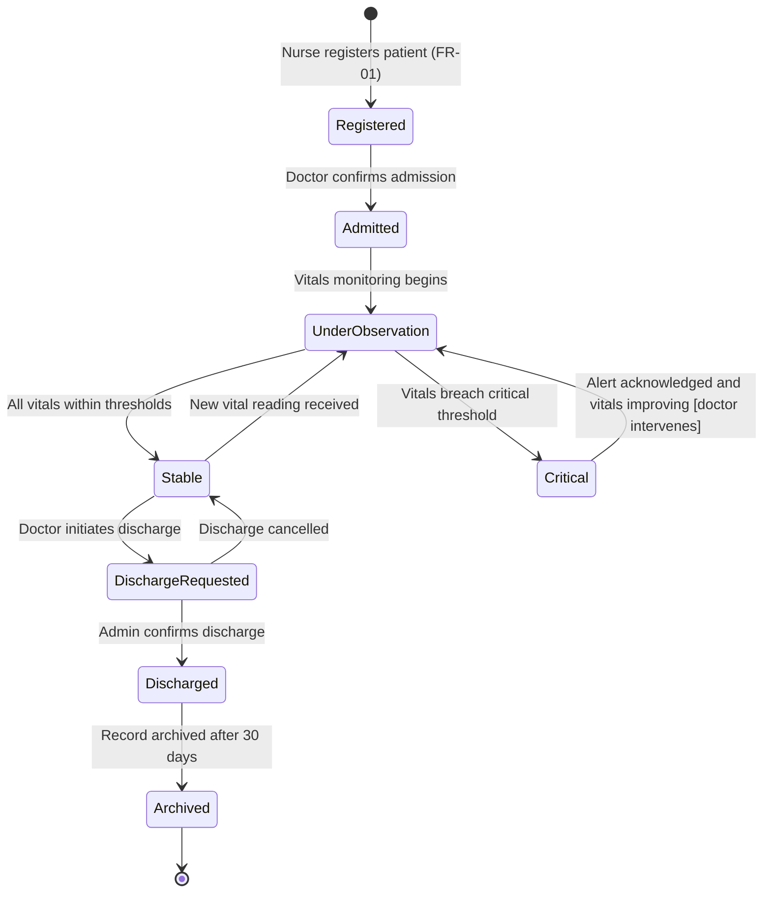
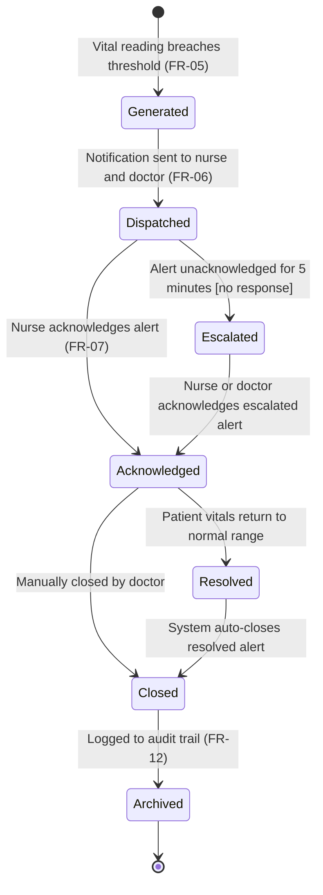
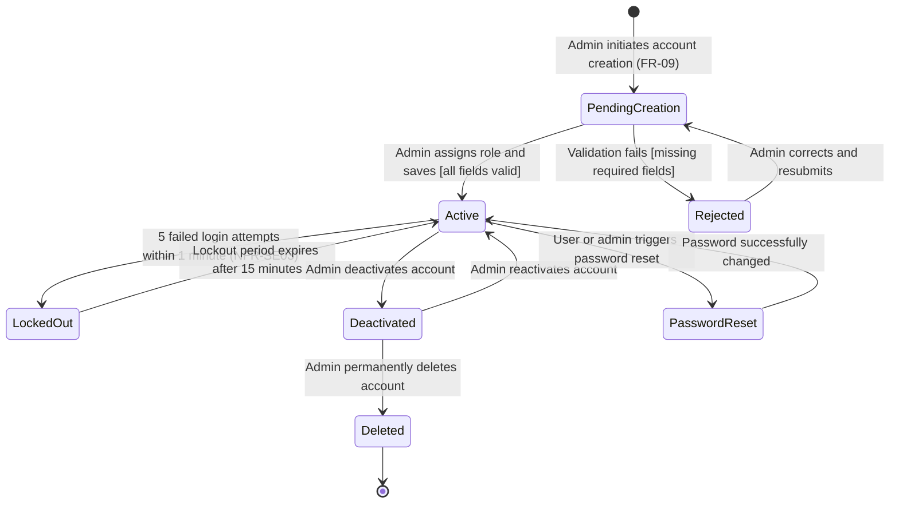
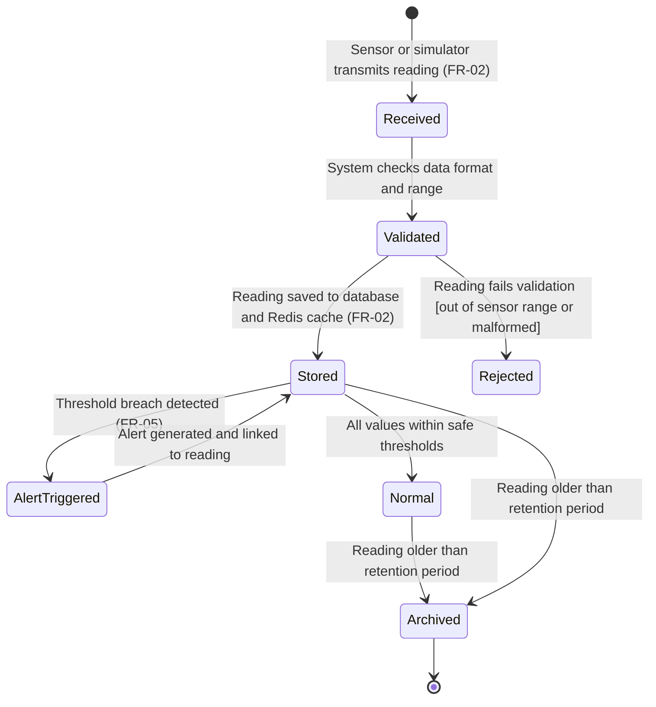
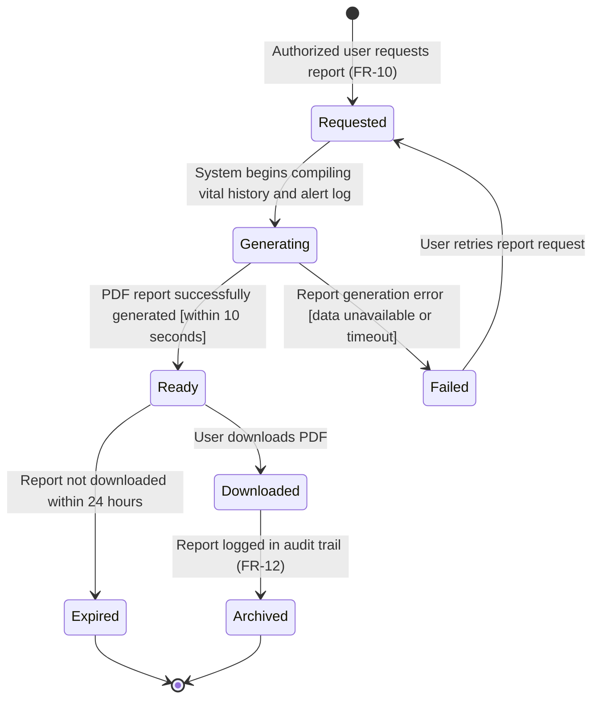
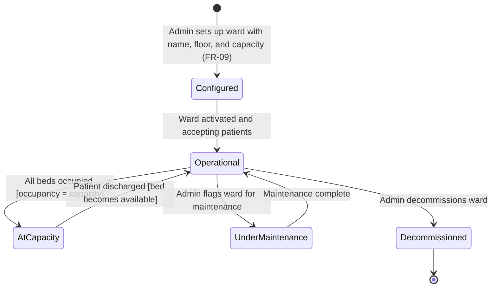
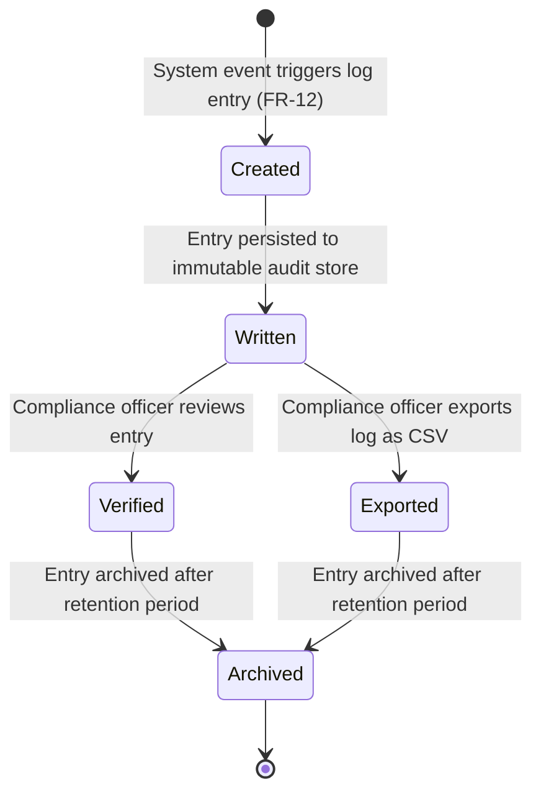

# STATE_DIAGRAMS.md — Object State Modeling
## Hospital Patient Monitoring System (HPMS)

> Traces to: [SRD.md](./SRD.md) | [ARCHITECTURE.md](./ARCHITECTURE.md) | [AGILE_PLANNING.md](./AGILE_PLANNING.md)

---

## 1. Patient Object



### Explanation
The Patient object moves through the most complex lifecycle in HPMS. Key states include **UnderObservation** (active monitoring), **Critical** (threshold breach detected), and **Discharged** (care episode complete).

- **Registered → Admitted**: Maps to FR-01 (Patient Registration) and US-001
- **UnderObservation → Critical**: Maps to FR-05 (Alert Generation) and US-003
- **Critical → UnderObservation**: Guard condition — only when doctor has intervened and vitals are improving
- **Stable → DischargeRequested**: Maps to FR-01 (discharge workflow)

---

## 2. Alert Object



### Explanation
The Alert object lifecycle is central to HPMS patient safety. The **Escalated** state is a critical guard — if no nurse acknowledges within 5 minutes, the alert escalates to the doctor automatically.

- **Generated → Dispatched**: Maps to FR-05, FR-06 and US-003, US-007
- **Dispatched → Escalated**: Guard condition — `[acknowledgement timeout > 5 minutes]`
- **Acknowledged → Resolved**: Maps to FR-07 and US-004
- **Closed → Archived**: Maps to FR-12 (Audit Log)

---

## 3. User Account Object



### Explanation
The User Account object manages the full identity lifecycle of all system users — Nurses, Doctors, and Admins.

- **PendingCreation → Active**: Maps to FR-09 (Role-Based Access) and US-009
- **Active → LockedOut**: Maps to NFR-SE03 (rate limiting after 5 failed attempts)
- **Active → Deactivated**: Maps to FR-09 (Admin can deactivate users)
- **LockedOut → Active**: Guard condition — `[15-minute lockout period elapsed]`

---

## 4. Vital Reading Object



### Explanation
Every vital reading follows this lifecycle from ingestion to archival. The **Rejected** state handles malformed or out-of-range sensor data that should not pollute patient history.

- **Received → Validated**: Maps to FR-02 (Vital Signs Ingestion)
- **Stored → AlertTriggered**: Maps to FR-05 (Alert Generation) and US-003
- **Rejected**: Guard condition — `[value outside physiological range OR malformed payload]`
- **Archived**: Maps to data retention policy in NFR

---

## 5. Alert Threshold Object

```mermaid
stateDiagram-v2
    [*] --> Default : System loads default thresholds on startup
    Default --> Active : Threshold applied to patient monitoring
    Active --> OverriddenByDoctor : Doctor sets patient-specific threshold (FR-04)
    OverriddenByDoctor --> Active : Doctor removes override [reverts to default]
    Active --> Updated : Admin updates system-wide default
    Updated --> Active : New default applied to all patients without overrides
    Active --> Inactive : Patient discharged [threshold deactivated]
    Inactive --> [*]
```

### Explanation
Alert thresholds control when alerts are generated. The system supports both global defaults and per-patient overrides.

- **Default → Active**: Maps to FR-04 (Configurable Alert Thresholds)
- **Active → OverriddenByDoctor**: Maps to FR-04 and US-005
- **Active → Inactive**: Guard condition — `[patient status = Discharged]`

---

## 6. Report Object



### Explanation
Reports are generated on demand and have a limited availability window to manage storage.

- **Requested → Generating**: Maps to FR-10 (Report Generation) and US-010
- **Generating → Ready**: Guard condition — `[generation time ≤ 10 seconds]`
- **Generating → Failed**: Guard condition — `[timeout OR missing data]`
- **Downloaded → Archived**: Maps to FR-12 (Audit Log)

---

## 7. Ward Object



### Explanation
The Ward object manages bed capacity and operational status across the hospital.

- **Configured → Operational**: Maps to FR-09 (Admin system configuration)
- **Operational → AtCapacity**: Guard condition — `[current occupancy = maximum capacity]`
- **Operational → UnderMaintenance**: Maps to IT Staff concern for planned downtime
- Maps to US-008 (Ward Summary Dashboard) and US-011

---

## 8. Audit Log Entry Object



### Explanation
Audit log entries are immutable once written — they cannot be modified or deleted by any user role.

- **Created → Written**: Maps to FR-12 (Audit Log) and US-011
- **Written → Exported**: Maps to FR-12 acceptance criteria (CSV export)
- **Archived**: Guard condition — `[entry age > retention period]`
- Directly addresses Compliance Officer stakeholder concerns in STAKEHOLDERS.md

---

## Traceability Summary

| Object | Key States | Mapped FR | Mapped US |
|---|---|---|---|
| Patient | Registered, Admitted, Critical, Discharged | FR-01, FR-05 | US-001, US-003 |
| Alert | Generated, Escalated, Acknowledged, Closed | FR-05, FR-06, FR-07 | US-003, US-004, US-007 |
| User Account | Active, LockedOut, Deactivated | FR-09, NFR-SE03 | US-009, US-012 |
| Vital Reading | Received, Stored, AlertTriggered, Archived | FR-02, FR-05 | US-002, US-003 |
| Alert Threshold | Default, OverriddenByDoctor, Inactive | FR-04 | US-005 |
| Report | Requested, Generating, Ready, Archived | FR-10, FR-12 | US-010, US-011 |
| Ward | Operational, AtCapacity, UnderMaintenance | FR-09, FR-11 | US-008, US-009 |
| Audit Log Entry | Created, Written, Exported, Archived | FR-12 | US-011 |
